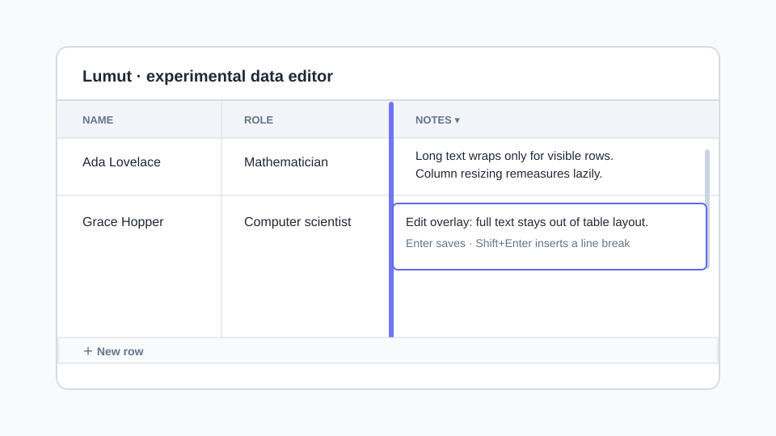

# lumut

An experimental, MIT-licensed AnyWidget data editor for notebook runtimes. It
uses TanStack Table for table state and TanStack Virtual for lazy, measured row
heights.

## Gallery

<div align="center">
  <a href="https://molab.marimo.io/github/banditelol/lumut/blob/main/demos/exp_data_editor.py/wasm?utm_source=lumut">
    
  </a>
  <br>
  <strong>exp_data_editor</strong><br>
  <a href="https://molab.marimo.io/github/banditelol/lumut/blob/main/demos/exp_data_editor.py/wasm?utm_source=lumut">molab</a> ·
  <a href="https://adityarp.com/lumut/reference/exp-data-editor/">API</a> ·
  <a href="docs/reference/exp-data-editor.md">Markdown</a>
</div>

<div align="center">
  <a href="https://molab.marimo.io/github/banditelol/lumut/blob/main/demos/data_editor_enchance.py/wasm?utm_source=lumut">
    
  </a>
  <br>
  <strong>data_editor_enchance</strong> (Glide rough resize experiment)<br>
  <a href="https://molab.marimo.io/github/banditelol/lumut/blob/main/demos/data_editor_enchance.py/wasm?utm_source=lumut">molab</a> ·
  <a href="https://adityarp.com/lumut/reference/data-editor-enchance/">API</a> ·
  <a href="docs/reference/data-editor-enchance.md">Markdown</a>
</div>

The preview is an illustration of the widget. The MoLab demo runs the actual
AnyWidget from this repository.

## Why it exists

`lumut.exp_data_editor` explores a small, marimo-compatible data-editor
contract without inheriting a grid library's entire feature surface. It accepts
row-oriented data, column-oriented data, or pandas-like dataframes; honours
`editable_columns`; and synchronizes fully edited rows as `value`.

Rows are measured only after they are rendered. Wrapped content can grow a row,
but never beyond `max_row_height`. Resizing a column triggers a remeasurement
of rendered rows, rather than an O(N) pass over all data.

## Why this does not use Glide Data Grid

Glide Data Grid remains a capable canvas-based editor, but its public
`rowHeight` API is either one constant or a callback indexed by row. In the
current implementation, the callback path requires the grid to walk row
heights to derive total height and map a scroll offset to a row. A cached
callback therefore does not make exact variable wrapped-row height suitable for
very large datasets. The upstream "fit content" request was discussed as a
consumer-side canvas-measurement workaround rather than delivered as a native
auto-height API.

Lumut instead uses TanStack Virtual's dynamic measurement model: unseen rows
have an estimate, rendered rows are measured, and the virtualizer adjusts
geometry as measurements arrive. `max_row_height` makes that refinement
bounded and predictable after column resizing.

Maintenance is a second consideration. Glide's most recent stable GitHub
release is 6.0.3 (February 2024), while development since then has appeared as
intermittent 6.0.4 alpha commits. That does not mean the project is abandoned,
but it makes an upstream change to its scroll geometry a higher-risk dependency
for an experimental component. Lumut depends on the MIT-licensed TanStack
Table and TanStack Virtual projects instead, and owns only the narrow editor
surface it needs.

References:

- [Glide `rowHeight` API](https://github.com/glideapps/glide-data-grid/blob/main/packages/core/API.md)
- [Glide issue #581: Make Row Height Fit Content](https://github.com/glideapps/glide-data-grid/issues/581)
- [Glide releases](https://github.com/glideapps/glide-data-grid/releases)
- [TanStack Virtual dynamic measurement example](https://tanstack.com/virtual/latest/docs/framework/react/examples/dynamic)

## Install and use

Install the published package with:

```bash
uv pip install lumut
```

For local development, build the JavaScript bundle before using the editable
package:

```bash
uv pip install -e .
npm install
npm run build
```

```python
import marimo as mo
from lumut import exp_data_editor

editor = mo.ui.anywidget(exp_data_editor(
    [
        {"name": "Ada", "notes": "A long value that can wrap naturally."},
        {"name": "Grace", "notes": "Another editable row."},
    ],
    label="People",
    editable_columns=["notes"],
    max_row_height=160,
))

editor
```

`editor.value` is the edited list of row dictionaries.

## Glide rough resize experiment

`data_editor_enchance` intentionally retains the spelling in its public name.
It is a Glide Data Grid implementation of the same small input/value contract
as `exp_data_editor` and `mo.ui.data_editor`, with `wrapped_columns` added.
During a wrapped-column resize it estimates a single capped row height from the
visible row window plus a 20-row buffer. On pointer release it applies that
sampled height to all rows. This avoids an O(N) measurement pass while dragging
but is an approximation, not content-fit auto-height: off-screen rows can be
over- or under-sized.

It deliberately pins the browser bundle to React 18: Glide 6.0.3 declares
React 16–18 peer support, whereas the TanStack-only editor has no such Glide
constraint.

Use this only for experimentation with eager small-to-medium data. Glide's
variable `rowHeight` callback still makes its scroll geometry a poor fit for a
million-row exact-auto-height editor. For a measured, bounded-height design,
use `exp_data_editor` and continue the planned windowed-data work in
[issue #1](https://github.com/banditelol/lumut/issues/1).

```python
from lumut import data_editor_enchance

glide_editor = data_editor_enchance(
    [{"notes": "Resize the notes column to try rough wrapping."}],
    editable_columns=["notes"],
    wrapped_columns=["notes"],
    max_row_height=160,
)
```

## Scope

This first experiment intentionally includes typed cell editing, column resize,
wrapped text, capped dynamic heights, and the AnyWidget value bridge. It does
not yet implement spreadsheet range selection, fill handles, structural
row/column operations, search, or server/windowed data.

## Project conventions

The project follows the useful parts of [wigglystuff](https://github.com/koaning/wigglystuff): a Python AnyWidget class, a bundled JavaScript entry point,
static assets packaged by Hatchling, a `Makefile`, and focused Python tests.

`AGENTS.md` is the Codex-native replacement for wigglystuff's Claude-facing
instructions. `.codex/workflows.md` records the equivalent development
commands. Conductor's declarative workspace schema (`.conductor/settings.toml`)
has no Codex equivalent, so it is intentionally not copied; the command mapping
is documented in `.codex/workflows.md` instead.

## Development

```bash
make install
make build
make test
make dev
```

To inspect the widget in marimo after installing the package locally, run
`uv run --with marimo marimo edit demos/exp_data_editor.py`.

## Releasing to PyPI

Releases use GitHub Actions and [PyPI Trusted Publishing](https://docs.pypi.org/trusted-publishers/), so a PyPI API token is not stored in this repository.

One-time setup:

1. If `lumut` is not yet on PyPI, add a **pending** Trusted Publisher in your PyPI account settings. If it already exists, add a Trusted Publisher in that project's Publishing settings. In both cases use project name `lumut`, owner `banditelol`, repository `lumut`, workflow file `publish.yml`, and environment `pypi`.
2. The first successful run of a pending publisher creates the PyPI project; its configured project name must exactly match `project.name`.
3. In GitHub, create the protected `pypi` environment if you want approvals before publication. The workflow works without protection too.

For each release, update `version` in `pyproject.toml`, add release notes, and create a GitHub release whose tag is `v<version>` (for example, `v0.1.0`). The publishing workflow rebuilds the frontend, builds and checks the wheel and source distribution, then uploads those exact artifacts to PyPI. To verify a build locally before creating the release, run `make package` and `uvx twine check dist/*`.
