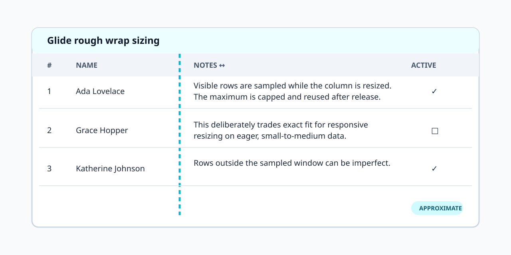

# Lumut

> *Lumut*—moss in Indonesian—is a marimo-focused AnyWidget collection and an
> experimental ground for new notebook widgets, heavily inspired by
> [wigglystuff](https://github.com/koaning/wigglystuff).

The current experiments focus on data editing, but Lumut is intentionally
broader than one widget. `exp_data_editor` is a deliberately narrow testbed
for typed editing, a Python value bridge, column resize, lazy row measurement,
and spreadsheet-like interactions in marimo.

## Install

```bash
uv pip install "lumut @ git+https://github.com/banditelol/lumut.git"
```

## Widget gallery

<div class="widget-gallery">
  <div class="gallery-item">
    <div class="gallery-title"><a href="reference/exp-data-editor/">exp_data_editor</a></div>
    <a target="_blank" href="https://molab.marimo.io/github/banditelol/lumut/blob/main/demos/exp_data_editor.py/wasm?utm_source=lumut" class="gallery-img"></a>
    <div class="gallery-links"><a target="_blank" href="https://molab.marimo.io/github/banditelol/lumut/blob/main/demos/exp_data_editor.py/wasm?utm_source=lumut">molab</a><a href="reference/exp-data-editor/">API</a><a href="reference/exp-data-editor.md">MD</a></div>
  </div>
  <div class="gallery-item">
    <div class="gallery-title"><a href="reference/data-editor-enhance/">data_editor_enhance</a></div>
    <a target="_blank" href="https://molab.marimo.io/github/banditelol/lumut/blob/main/demos/data_editor_enhance.py/wasm?utm_source=lumut" class="gallery-img"></a>
    <div class="gallery-links"><a target="_blank" href="https://molab.marimo.io/github/banditelol/lumut/blob/main/demos/data_editor_enhance.py/wasm?utm_source=lumut">molab</a><a href="reference/data-editor-enhance/">API</a><a href="reference/data-editor-enhance.md">MD</a></div>
  </div>
</div>

## Design notes

The widget uses TanStack Virtual's measured-size path. New rows start at an
estimated height, only rendered rows are measured, and `max_row_height` bounds
the effect of exceptionally long content. See the [API reference](reference/exp-data-editor.md)
for the Python contract and [issue #1](https://github.com/banditelol/lumut/issues/1)
for the planned windowed-data architecture.

`data_editor_enhance` is a separate Glide experiment. It samples the visible
window during wrapped-column resize and applies the capped sampled height
globally after release. That keeps resize work bounded, but it is deliberately
approximate and is not suitable for million-row exact auto-height.
